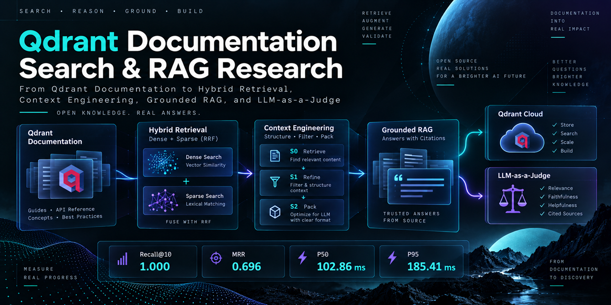

# Qdrant Documentation Search & RAG Research

<p align="center">
  
</p>

A production-oriented documentation search and RAG research project developed as the **final project for the Qdrant Essentials course**.

The project is based on the official Day 6 assignment — **[Final Project: Production-Ready Documentation Search Engine](https://qdrant.tech/course/essentials/day-6/final-project/)** — and extends the original task with systematic retrieval experiments, Qdrant Cloud deployment, Context Engineering research, grounded generation, LLM-as-a-Judge evaluation, and separate confirmation and final-holdout validation stages.

The complete research workflow is implemented in a single reproducible notebook:

```text
notebooks/01_qdrant_rag_research_retrieval.ipynb
```

---

## Project Overview

The original Qdrant Essentials final project asks for a documentation search system that includes:

- structured document ingestion and chunking;
- dense and sparse retrieval;
- server-side hybrid fusion;
- multivector / ColBERT reranking;
- Recall@10, MRR, and latency evaluation;
- documented architectural decisions and reproducible configuration.

This implementation uses the **Qdrant documentation** as the corpus and treats the course assignment as the starting point for a broader research project.

The project is divided into two major parts.

**Part I — Retrieval & Vector Store Research**

Build, investigate, and freeze the retrieval layer:

```text
Qdrant docs
→ parsing
→ structure-aware chunking
→ embeddings
→ Qdrant
→ retrieval experiments
→ HNSW / filtering / quantization tuning
→ final collection
→ Qdrant Cloud
```

**Part II — RAG & Context Engineering Evaluation**

The retrieval configuration is frozen, after which the project investigates how retrieved evidence should be prepared before generation:

```text
Qdrant Cloud
→ frozen hybrid retrieval
→ Context Engineering
→ Gemma generation
→ correctness / groundedness / citation evaluation
→ confirmation
→ final holdout
```

---

## What This Project Demonstrates

The notebook covers the complete path from raw documentation to a validated RAG pipeline:

- structure-aware parsing of Markdown documentation;
- semantic chunking;
- dense retrieval with `BAAI/bge-small-en-v1.5`;
- sparse retrieval with `prithivida/Splade_PP_en_v1`;
- experiments with RRF and DBSF hybrid fusion;
- experiments with ColBERT multivector reranking;
- Recall@10, MRR, P50, and P95 latency evaluation;
- HNSW parameter research;
- payload indexing and filtering benchmarks;
- binary quantization with rescoring;
- deployment of the final collection to Qdrant Cloud;
- comparison of Context Engineering strategies on the same frozen candidate pool;
- grounded generation with inline citations;
- LLM-as-a-Judge evaluation of correctness and groundedness;
- deterministic citation-contract auditing;
- evaluation dataset separation into research / confirmation / final holdout splits.

An important outcome of the research is that **ColBERT was fully evaluated but was not selected for the final retrieval pipeline**. The final architecture was chosen from measured results rather than from an assumed design.

---

## System Architecture

```text
                           Qdrant documentation
                                   │
                                   ▼
                        Structure-aware parsing
                                   │
                                   ▼
                         Semantic chunk assembly
                                   │
                    ┌──────────────┴──────────────┐
                    │                             │
                    ▼                             ▼
          Dense BGE embeddings             SPLADE sparse vectors
                    │                             │
                    └──────────────┬──────────────┘
                                   ▼
                            Qdrant collection
                                   │
                                   ▼
                          Hybrid retrieval + RRF
                                   │
                            top-10 candidates
                                   │
                                   ▼
                     Adaptive section expansion
                              (Context S1)
                                   │
                                   ▼
                       Gemma 4 grounded generation
                                   │
                                   ▼
                  Answer + inline [S#] citations
                                   │
                ┌──────────────────┼──────────────────┐
                ▼                  ▼                  ▼
           Correctness        Groundedness      Citation audit
             judge               judge          deterministic
```

The final collection is first reproduced locally and then deployed to **Qdrant Cloud**.

Part II independently starts from the frozen Cloud collection.

---

## Dataset

The corpus is a fixed snapshot of the Qdrant documentation repository:

```text
Source commit:
46e80312568d1e4505917b94c1ef78f4000330aa
```

Final corpus characteristics:

| Item | Value |
|---|---:|
| Parsed documentation sections | 2,735 |
| Final Qdrant points | 4,134 |
| Evaluation queries | 85 |
| Qrels | 92 |
| Research queries | 45 |
| Confirmation queries | 20 |
| Final holdout queries | 20 |

The evaluation dataset includes how-to, conceptual, API-usage, and troubleshooting queries.

---

## Final Retrieval Configuration

The final production-oriented retrieval configuration is frozen as `retrieval-v1`.

| Component | Final configuration |
|---|---|
| Collection | `docs_search_final` |
| Dense model | `BAAI/bge-small-en-v1.5` |
| Dense dimensions | 384 |
| Distance | Cosine |
| Sparse model | `prithivida/Splade_PP_en_v1` |
| Fusion | Reciprocal Rank Fusion (RRF) |
| Dense prefetch | 50 |
| Sparse prefetch | 50 |
| Final retrieval | Top 10 |
| ColBERT | Evaluated, not selected |
| HNSW `m` | 8 |
| HNSW `ef_construct` | 400 |
| Query-time `hnsw_ef` | 64 |
| Quantization | Binary |
| Rescoring | Enabled |
| Oversampling | 2.0 |
| Payload | On disk |
| `tags` payload index | Keyword |

Final retrieval evaluation on the untouched holdout produced:

| Metric | Result |
|---|---:|
| Recall@10 | **1.000** |
| MRR | **0.696** |
| P50 latency | **102.86 ms** |
| P95 latency | **185.41 ms** |

Latency values are specific to the environment in which the benchmark was executed.

---

## Context Engineering Research

After the retrieval configuration was frozen, the same retrieved candidates were used to compare three context-construction strategies:

| Strategy | Description |
|---|---|
| S0 | Raw retrieved chunks |
| S1 | Adaptive section expansion |
| S2 | Evidence-aware budgeted packing |

Results on the 45-query research split:

| Strategy | Correctness | Groundedness | Citation contract | Mean context tokens |
|---|---:|---:|---:|---:|
| S0 — retrieved chunks | 1.956 | 2.933 | 44/44 | 3,180.6 |
| **S1 — adaptive section expansion** | **1.956** | **3.000** | **44/44** | 3,485.8 |
| S2 — evidence-aware packing | 1.933 | 2.889 | 43/44 | 3,184.2 |

Correctness and groundedness are scored on a `0–3` scale.

S0 and S1 achieved the same aggregate correctness. S1, however, reached the maximum groundedness score while preserving full raw citation-contract compliance.

S1 was therefore frozen not as a universally superior strategy, but as the **quality-first configuration** among the strategies evaluated here.

The trade-off was approximately **9.6% more context** than S0.

---

## Independent RAG Validation

After S1 was selected on the research split, the following were frozen:

- retrieval configuration;
- Context Engineering strategy;
- generation settings;
- evaluation rubrics.

The same pipeline was then evaluated without additional tuning on the `confirmation` and `final_holdout` splits.

| Split | Queries | Correctness | Groundedness | Citation contract |
|---|---:|---:|---:|---:|
| Research | 45 | 1.956 | 3.000 | 44/44 |
| Confirmation | 20 | **2.350** | **2.950** | **20/20** |
| Final holdout | 20 | **2.500** | **2.900** | **20/20** |

The validation stages are used only to evaluate the already-frozen pipeline and do not reopen strategy selection or retrieval tuning.

---

## RAG Generation

Generation runs through a local OpenAI-compatible **vLLM** server:

```text
Model:
google/gemma-4-12B-it-qat-w4a16-ct

Served name:
gemma-4-12b-it
```

The RAG prompt requires answers to rely only on the supplied evidence sources and to include inline source identifiers:

```text
[S1]
[S2]
...
```

If the supplied context is insufficient, the pipeline performs a canonical abstention rather than generating an unsupported answer.

The evaluation layer includes:

- a correctness judge against qrel-derived reference evidence;
- a groundedness judge against the exact context supplied to the generator;
- a deterministic audit of raw citation syntax and source IDs.

These evaluation components are separate from the online answer-generation path.

---

## Repository Structure

```text
Qdrant_Final_Project/
│
├── .devcontainer/
│   ├── Dockerfile.dev_host
│   ├── Dockerfile.qdrant
│   ├── devcontainer.json
│   ├── docker-compose.yaml
│   ├── production.yaml
│   └── .env.vllm.example
│
├── artifacts/
│   └── .gitkeep
│
├── data/
│   ├── processed/
│   │   └── .gitkeep
│   ├── raw/
│   │   └── .gitkeep
│   └── .gitkeep
│
├── notebooks/
│   └── 01_qdrant_rag_research_retrieval.ipynb
│
├── .env.example
├── .gitignore
├── .python-version
├── LICENSE
├── pyproject.toml
├── README.md
└── uv.lock
```

Downloaded source data, model/runtime state, and generated experiment artifacts are intentionally excluded from Git.

---

## Requirements

The full notebook is designed to run through the included Dev Container and Docker Compose configuration.

You will need:

- Git;
- Docker / Docker Desktop;
- VS Code with the Dev Containers extension;
- an NVIDIA GPU available to Docker for the vLLM service;
- a Qdrant Cloud cluster;
- a Qdrant Cloud API key;
- a Hugging Face token with access to the configured Gemma model.

The project uses Python `3.10`.

Explicitly pinned service versions:

```text
Qdrant: qdrant/qdrant:v1.19.1
vLLM:  vllm/vllm-openai:v0.29.0-cu129
```

The development image currently uses:

```text
huggingface/transformers-all-latest-gpu@sha256:4175a7cc4609799c003c875088510bdd31f76ad17b1e6e8fee16486b342c4e1a
```

Python dependencies are locked through `uv.lock`.

---

## Quick Start

### 1. Clone the repository

```bash
git clone https://github.com/artyomboyko/Qdrant_Final_Project.git
cd Qdrant_Final_Project
```

### 2. Create the environment files

Create the main environment file from the provided template:

```bash
cp .env.example .env
```

Configure your Qdrant Cloud credentials:

```dotenv
QDRANT_CLOUD_URL=https://YOUR-CLUSTER.cloud.qdrant.io
QDRANT_CLOUD_API_KEY=YOUR_QDRANT_CLOUD_API_KEY
```

The Local Qdrant and vLLM values in `.env.example` are already aligned with the Docker Compose network.

Create the vLLM environment file:

```bash
cp .devcontainer/.env.vllm.example .devcontainer/.env.vllm
```

Provide your Hugging Face token:

```dotenv
HF_TOKEN=YOUR_HUGGING_FACE_TOKEN
VLLM_USE_V2_MODEL_RUNNER=0
```

Real `.env` files are excluded from Git.

### 3. Start the Docker services

From the host machine:

```bash
docker compose -f .devcontainer/docker-compose.yaml up -d --build
```

The stack includes:

```text
qdrant             local vector database
dev_host           VS Code / Python development environment
vllm-gemma4-12b    local OpenAI-compatible Gemma inference server
```

### 4. Open the project in the Dev Container

Open the repository in VS Code and use **Reopen in Container** with the provided Dev Container configuration.

The Python environment is created under:

```text
/opt/venv
```

Dependencies are synchronized from:

```text
pyproject.toml
uv.lock
```

### 5. Run the notebook

Open:

```text
notebooks/01_qdrant_rag_research_retrieval.ipynb
```

and execute **Run All** from a clean kernel.

The notebook runs the complete workflow:

```text
download docs
→ parse corpus
→ build chunks
→ run retrieval research
→ build final local collection
→ validate retrieval
→ deploy final collection to Qdrant Cloud
→ run Context Engineering research
→ run RAG evaluation
→ confirmation validation
→ final holdout validation
```

### Important

A full clean run intentionally recreates the final Qdrant collection.

The configured Cloud collection name is:

```text
docs_search_final
```

Do not point the notebook at a production Qdrant Cloud cluster containing a collection with that name unless replacing it is intentional.

---

## Generated Artifacts

Part II creates evaluation artifacts under `artifacts/`, including:

```text
part_ii_evaluation_bundle.json
rag_evaluation_research.json
rag_evaluation_confirmation.json
rag_evaluation_final_holdout.json
```

During an incomplete research run, the following checkpoint may also exist:

```text
rag_evaluation_research_checkpoint.json
```

The checkpoint is removed after the research stage completes successfully.

Generated artifacts are excluded from Git so that repository history contains the experiment definition and reproducible pipeline rather than large run-specific JSON files.

---

## Reproducibility

The project is designed around the following workflow:

```text
clone repository
→ configure .env files
→ start Docker services
→ open Dev Container
→ Run All
```

Main reproducibility controls include:

- a fixed source commit for the Qdrant documentation;
- deterministic evaluation bundle construction;
- frozen research / confirmation / final-holdout splits;
- retrieval configuration frozen before RAG evaluation;
- reuse of one candidate pool when comparing S0 / S1 / S2;
- deterministic generation settings (`temperature=0`, `top_p=1`, fixed seed);
- explicit final-holdout unlock only after confirmation;
- no post-holdout tuning;
- Python dependencies locked through `uv.lock`.

The evaluation bundle from the final full run records:

```text
Documentation commit:
46e80312568d1e4505917b94c1ef78f4000330aa

Canonical evaluation-data SHA-256:
5cca44e60cda795e858480417c01c806da1246d6b9467e03563da1697ac6e7d9
```

---

## Known Limitations

A more detailed discussion appears at the end of the notebook. The main limitations are:

- the evaluation dataset is relatively small, so small differences between close configurations should not be treated as statistically definitive;
- latency-sensitive results depend on the hardware and runtime environment;
- the GPU-oriented HNSW experiment selected `ef_construct=400`, while the historical CPU portability replay selected `ef_construct=100`;
- the same Gemma model is used for generation and LLM-as-a-Judge evaluation, introducing potential self-evaluation bias;
- LLM-as-a-Judge is not a replacement for independent human evaluation;
- the study covers a single domain and one fixed documentation snapshot;
- only three Context Engineering strategies were compared;
- retrieval and Context Engineering were intentionally studied sequentially rather than jointly optimized;
- the final holdout is procedurally protected, but its specification is physically present in the notebook-generated evaluation bundle;
- exact results depend on the frozen models, software versions, and infrastructure.

These limitations define the scope of the conclusions rather than invalidate the completed evaluation.

---

## Project Background

This repository was developed as the **final project for the Qdrant Essentials course**.

Official course:

[Qdrant Essentials](https://qdrant.tech/course/essentials/)

Official assignment:

[Day 6 — Final Project: Production-Ready Documentation Search Engine](https://qdrant.tech/course/essentials/day-6/final-project/)

The course assignment provided the retrieval-oriented foundation of the project.

This implementation extends it into a broader retrieval and RAG research project while preserving the original requirement to build a measurable, documented, and reproducible documentation search system.

---

## License

This project is licensed under the **Apache License 2.0**.

See `LICENSE` for details.
